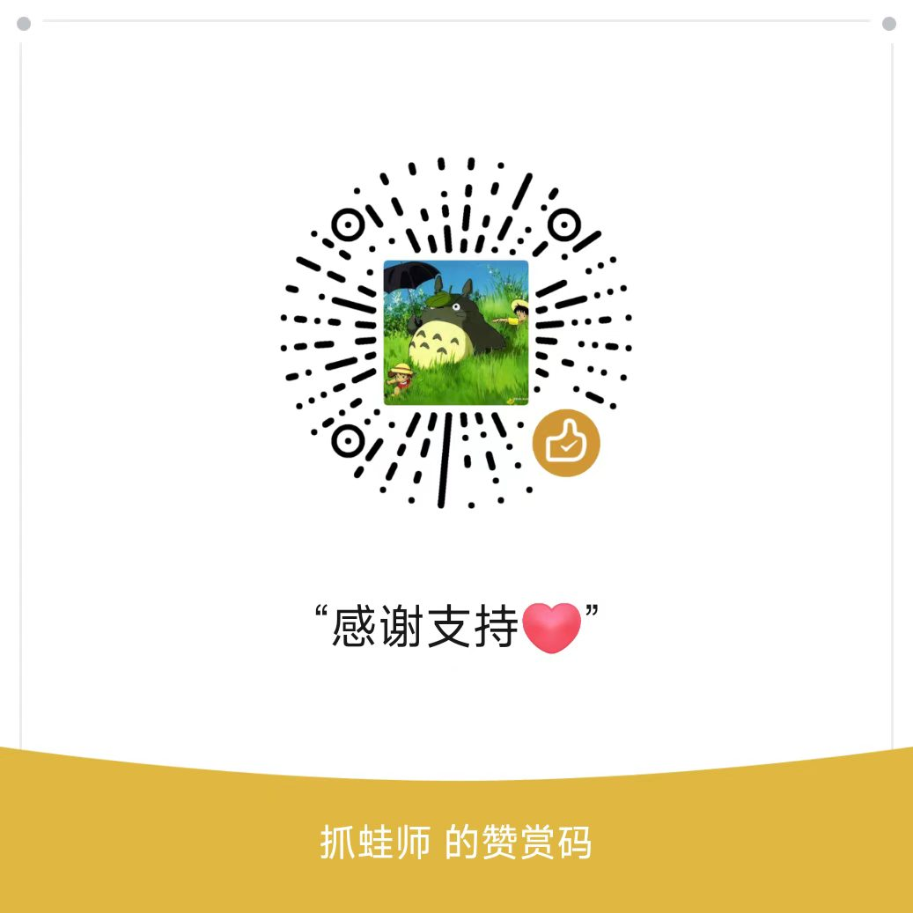

# Knowledge Base

本地知识库桌面应用 - 全文搜索、双向链接、知识图谱

基于 Tauri 2.x 构建的桌面应用。

## 开发

```bash
pnpm install
pnpm tauri dev
```

## 构建

```bash
pnpm tauri build
```

## 许可证（License）

本项目采用 **[GNU AGPL-3.0](LICENSE)** 协议开源（双许可模式）。

| 使用场景 | 是否需要付费 | 要求 |
|---------|-------------|------|
| 个人学习、研究、非商业使用 | ✅ 免费 | 遵守 AGPL-3.0（修改后开源、保留版权声明） |
| 开源项目二次开发 | ✅ 免费 | 派生作品必须以 AGPL-3.0 协议开源 |
| 企业内部工具（不分发） | ✅ 免费 | 遵守 AGPL-3.0 |
| **闭源商用、打包销售** | ⚠️ 需商业授权 | AGPL-3.0 禁止闭源分发 |
| **SaaS / 网络服务部署**（不公开源码） | ⚠️ 需商业授权 | AGPL-3.0 要求向用户提供源码 |
| **集成进专有软件再分发** | ⚠️ 需商业授权 | 违反 AGPL-3.0 "传染性" |

> 💡 简单说：自己玩、开源玩 → 免费；想闭源卖钱、做 SaaS 不开放源码 → 联系我购买商业授权。

### 商业授权咨询

如需不受 AGPL-3.0 约束的商业授权，请联系：

- **QQ / 微信**：`770492966`
- 详细条款见 [COMMERCIAL-LICENSE.md](COMMERCIAL-LICENSE.md)

## 贡献（Contributing）

欢迎贡献代码、报告 Bug、提建议！

⚠️ **提交 PR 前请务必阅读 [CONTRIBUTING.md](CONTRIBUTING.md)**，特别注意：

- 本项目为 **AGPL-3.0 + 商业授权** 双许可模式
- 所有外部 PR 必须同意 **CLA（贡献者许可协议）**
- 未勾选 CLA 同意的 PR **不会被审核**

快速入口：

- 🐛 [报告 Bug](../../issues/new?template=bug_report.md)
- ✨ [功能建议](../../issues/new?template=feature_request.md)
- 🔨 [提交 Pull Request](../../compare)
- 💼 [商业授权咨询](COMMERCIAL-LICENSE.md)

## 社区交流

| 渠道 | 入口 |
|------|------|
| QQ 交流群（Bug 反馈 / 使用交流 / 新功能讨论） | 群号 `1090770702` |
| B 站作者主页（教程视频 / 功能演示） | <https://space.bilibili.com/520725002> |
| 知识星球（后端转 AI 实战派） | 星球号 `91839984` |
| 应用文档站点 | <https://kb.ruoyi.plus/> |

## 赞赏支持 ☕

本项目完全开源、免费、无任何会员或订阅。如果它帮到了你，欢迎扫描下面微信赞赏码请作者喝杯咖啡：

<p align="center">
  
</p>

不想赞赏也完全没问题，下面这些事一样能帮到作者：

- ⭐ 在 [GitHub](https://github.com/bkywksj/knowledge-base) / [Gitee](https://gitee.com/bkywksj/knowledge-base) 给项目点 Star
- 🎬 在 B 站关注作者主页
- 📣 推荐给身边需要的朋友
- 📋 提 Issue 反馈 Bug / 功能建议
